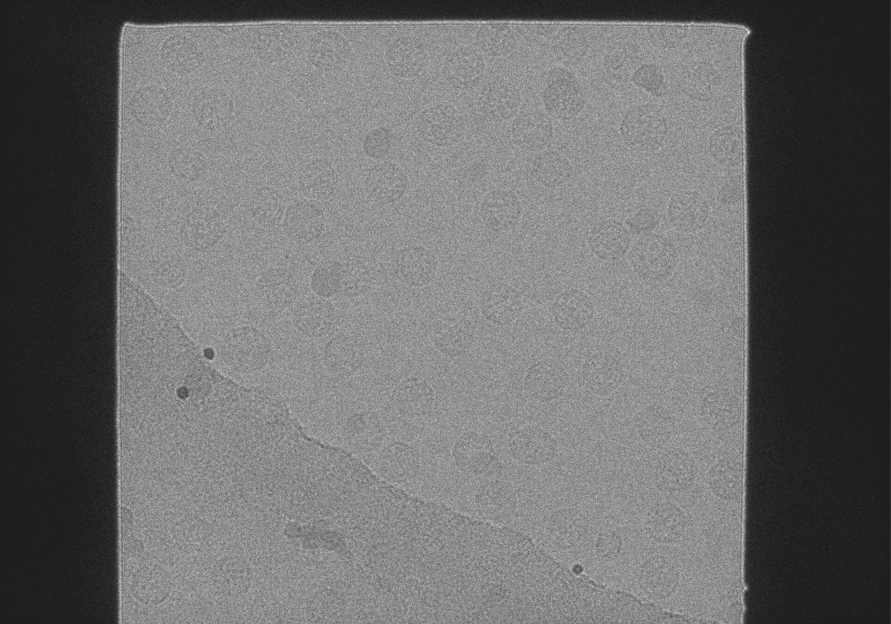
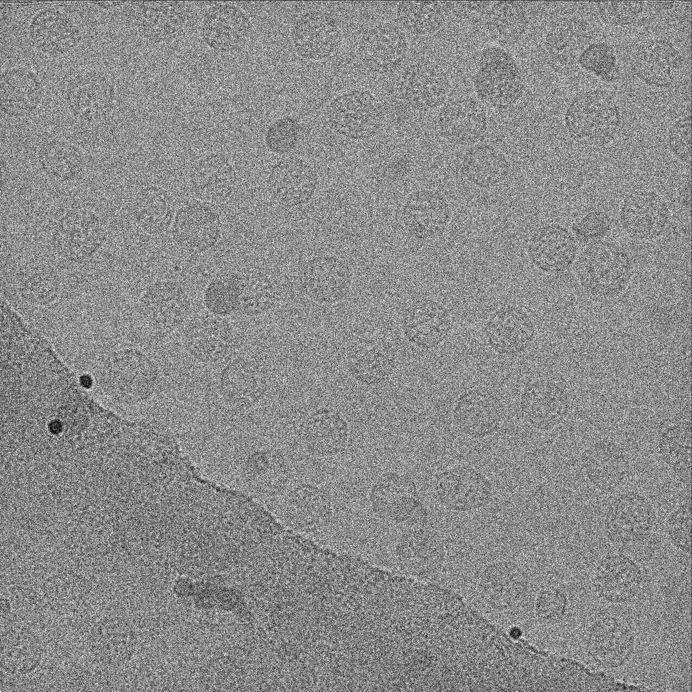
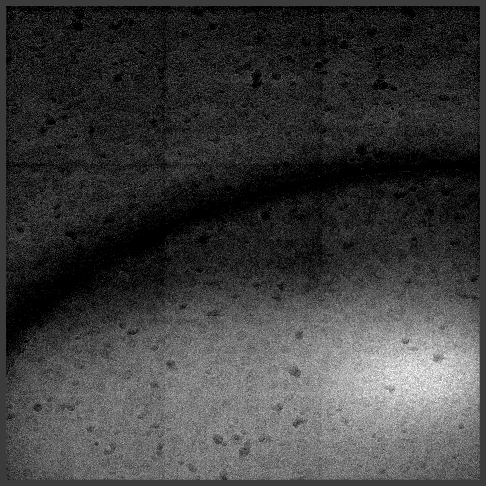

## Preprocessing the frameseries data
First , we will run the motion and CTF estimation on the frameseries data. The following command will run WarpTools fs_motion_and_ctf with the specified settings and parameters. Make sure to adjust the CUDA_VISIBLE_DEVICES variable to match your available GPUs.
```bash
export CUDA_VISIBLE_DEVICES=0,1,2,3;WarpTools fs_motion_and_ctf \
--settings warp_frameseries.settings \
--m_grid 3x3x4 \
--c_grid 4x4x1 \
--c_range_max 7 \
--c_defocus_max 8 \
--c_use_sum \
--out_averages
```
<details>
  
```ruby
Running command fs_motion_and_ctf with:
m_range_min = 500
m_range_max = 10
m_bfac = -500
m_grid = 3x3x4
c_window = 512
c_range_min = 30
c_range_max = 7
c_defocus_min = 0.5
c_defocus_max = 8
c_voltage = 300
c_cs = 2.7
c_amplitude = 0.07
c_fit_phase = False
c_use_sum = True
c_grid = 4x4x1
out_averages = True
out_average_halves = False
out_thumbnails = null
out_skip_first = 0
out_skip_last = 0
device_list = {  }
perdevice = 1
workers = {  }
settings = warp_frameseries.settings
input_data = {  }
input_data_recursive = False
input_processing = null
output_processing = null
input_norawdata = False
strict = False

No alternative input specified, will use input parameters from warp_frameseries.settings
File search will be relative to /data1/users/Krios_Data/HRR/HRR036_1_TEM_250220/tiled_data/frames/
11954 files found
Parsing previous results for each item, if available...
11954/11954, previous metadata found for 0
Connecting to workers...
Connected to 4 workers
11954/11954, 00:00 remaining
Finished processing in 01:30:33
Saying goodbye to all workers... Done
Saving settings... Done
```

</details>
<summary>Output from writing the new config file</summary>

## Writing the New Config File:
```bash
sqap-montage write-config montage_example.yaml
Template config written to 'montage_example.yaml'.
```

## Cropping the Tiles to the Square-Aperture Area
Here we need to set the relevant parameters in the montage_example.yaml file.
The command to run the cropping step is:
```bash
sqap-montage crop --config montage_example.yaml
```
And the relevant parameters in the montage_example.yaml file are shown below.

```ruby
# =============================================================================
# Step 1: crop — remove blank aperture borders from each tile image
# =============================================================================
crop:
  input_dir:      tiled_data/warp_frameseries/average/   # motion-corrected average MRCs
  output_dir:     cropped           # creates cropped/averages/ and cropped/frames/
  processing_dir: processing/crop   # boundary coordinate files (can delete after)

  crop_frames:    true              # also crop matching raw frame stacks
  frames_dir:     tiled_data/frames/            # raw frame MRCs/TIFs (only if crop_frames: true)
  # Suffix on average filenames absent from frame filenames. Leave "" if stems match.
  # Example: averages "img_avg.mrc" + frames "img.tif" → averages_suffix: "_avg"
  averages_suffix: ""

  crop_x:         3840              # final tile width in pixels
  crop_y:         3840              # final tile height in pixels

  # Detection parameters — usually don't need changing
  filter_window:  200               # moving-average filter width
  mask_threshold: 0.5               # fraction of peak → illuminated region
  trim:           50                # pixels to shave inside the detected edge

```


This will take ~ 2 hours and it will be quicker if you skip montaging the frames. The cropped images will be in the cropped/averages and cropped/frames directories. The processing/crop directory will contain the boundary coordinate files, which can be deleted after cropping is complete.
```ruby
Found 11954 image(s) to process.
  Workers: 41 (parallel)
Cropping:  75%|██████████████████████████████████████████████████████████████████████████████████████████████████████████████████████████████████████████████████████████████████████████████████████████████████████████████████████████████████████████████████████████████████████████████                                                                                        | 9017/11954 [1:51:48<25:27,  1.92it/s]  [ERROR] /data1/users/Krios_Data/HRR/HRR036_1_TEM_250220/tiled_data/warp_frameseries/average/2025-02-18_00.43.48_VLP3x3_p05_ts_004_VLP3x3_p05_ts_004_0_1_001_0000_3.0.mrc: Image has no positive signal — cannot detect aperture boundaries.
Cropping: 100%|█████████████████████████████████████████████████████████████████████████████████████████████████████████████████████████████████████████████████████████████████████████████████████████████████████████████████████████████████████████████████████████████████████████████████████████████████████████████████████████████████████████████████████████████████████| 11954/11954 [2:26:25<00:00,  1.36it/s]
Crop done.
  [cleanup] removed 0 intermediate .mrc file(s) from /data1/users/Krios_Data/HRR/HRR036_1_TEM_250220/processing/crop
```

An important reason to crop at 3840 which is smaller than the illumination area is to avoid the dark edges of the tiles. The dark edges will cause problems during montaging, the blend method uses a weighted average of overlapping pixels, and if the edges are dark, it will create artifacts in the final stitched image. By cropping to a smaller size, we ensure that only the well-illuminated central region of each tile is used for blending and because there is an overlap between the tiles, the final image will be clear.

An example is shown bellow:

Before Cropping:



After Cropping:



## Montaging (blending) the tiles
This is the main step of the workflow. The montaging step will blend the cropped tiles into a single image. On 41 CPUs this step finished in ~15 minutes per tilt-series. 

The command in 
```bash
sqap-montage blend --config montage_example.yaml
```
and the relevant parameters in the montage_example.yaml file are shown below. The output will be in the blended/averages and blended/frames directories. The processing/blend directory will contain intermediate stacks, plins, etc., which can be deleted after blending is complete.

```ruby
blend:
  mdoc_dir:       tiled_data/Mdoc   # per-tile SerialEM .mrc.mdoc files
  averages_dir:   cropped/averages  # cropped average images from step 1
  frames_dir:     cropped/frames    # cropped frame stacks from step 1
  output_dir:     blended           # creates blended/averages/ and blended/frames/
  processing_dir: processing        # intermediate stacks, plins, etc. (can delete after)

  blend_size:     11664             # output image edge length after clip resize
  blend_frames:   true              # also blend per-frame stacks
  num_frames:     4                 # raw frames per exposure (used with blend_frames)

  # Linearly rescale each off-center tile so its mean and standard deviation
  # match the center (_0_0) tile before blending, reducing intensity seams.
  #   normalize_averages_to_center: apply to the average (motion-corrected) images
  #   normalize_frames_to_center:   apply to the per-frame stacks (blend_frames only)
  normalize_averages_to_center: false
  normalize_frames_to_center:   false

  # Process only these tilt-series (leave empty [] for all)
  # ts_filter: [VLP3x3_p01_ts_002, VLP3x3_p01_ts_003]
  ts_filter: []

  # Preview stack — one binned MRC per tilt-series sorted by tilt angle
  preview:         true
  preview_binning: 24          # bin factor passed to newstack -bin
  preview_dir:     blended/previews

  # Optional overrides — both default to siblings of processing_dir
  # (i.e. processing/log/ and processing/sh_files/). Set to a path to relocate.
  # log_dir holds one log per IMOD command, named {ts}_{tilt}_{command}.log,
  # with the executed command, return code, and full stdout + stderr.
  # sh_files_dir holds one re-runnable shell script per tilt-series.
  # log_dir:      processing/log
  # sh_files_dir: processing/sh_files

  # SerialEM occasionally writes PixelShiftFromCenter values that are 1–2 px
  # off the regular grid (e.g. 3682 and 7365 instead of 3682 and 7364).
  # blendmont rejects non-uniform spacings, so each shift is snapped to the
  # nearest integer multiple of the per-axis step before being written to
  # the .plin file. Set to false to feed blendmont the raw mdoc values.
  snap_shifts_to_grid: true

  # How much of the averages' blendmont solution the per-frame blends reuse.
  # By default each frame recomputes its own edge functions and cross-
  # correlations from scratch, which is slow and can drift from the average.
  #   none        — recompute every frame independently (current behaviour)
  #   edges       — reuse the averages' .xef/.yef edge functions (-oldedge)
  #   edges-xcorr — additionally reuse the .ecd cross-correlations
  #                 (-oldedge -readxcorr); frames inherit the average's
  #                 geometry exactly (maximum consistency, biggest speedup)
  # Only relevant when blend_frames: true.
  frame_edge_reuse: none

    # NOTE: changing sum_for_gradient / other_gradient_file / flatfield_file
  # invalidates cached edge functions; sqap-montage deletes the stale
  # .ecd/.xef/.yef files for the affected rootname automatically.
  intensity:
    # -intensity / -FixIntensityFromEdges
    #   0 = off, 1 = solve scaling factors from overlap-zone differences
    #   (default), 2 = also fit and remove a planar gradient first.
    fix_from_edges: 1

    # -base / -BaseIntensityForScaling
    #   Value subtracted before scaling and added back after. null = omit the
    #   flag (blendmont default). Use -32768 if unsigned data are stored as
    #   signed integers. Only meaningful with fix_from_edges > 0.
    base: null

    # -sum / -SumPiecesForGradient
    #   Sum all pieces, run "clip planefit" on the input, and correct every
    #   piece for the resulting planar gradient. Mutually exclusive with
    #   other_gradient_file.
    sum_for_gradient: false

    # -other / -OtherSumGradientFile
    #   Pre-computed planar gradient file. Mutually exclusive with
    #   sum_for_gradient. Relative paths resolve from data_dir.
    other_gradient_file: null

    # -flatfield / -FlatfieldFile
    #   Flatfield image to scale by, e.g. from "clip flatfield -n 3".
    #   Relative paths resolve from data_dir.
    flatfield_file: null
  ```

  The `frame_edge_reuse` option is useful for speeding up the blending of the frames. The `edges` option will reuse the edge functions from the averages, while the `edges-xcorr` option will also reuse the cross-correlations. The `none` option will recompute everything from scratch for each frame, which is the default behaviour. This option is experimental and we have not tested the speedup and the quality of the montaged frames using this option.
  This step also creates previews of the montaged tilt-series in the blended/previews directory. The previews are binned by 24 (or the value chosen by the user) and are useful for quickly checking the quality of the montaging step. The previews are named {tilt-series}_preview.mrc and can be opened in IMOD or any other MRC viewer.

  

  What we have lately added to the code is using blendmont's intensity correction.

  

  ## Filling the gaps (experimental)
  We are also working on a step to fill some of the gaps and remove the seams that might arise from blending. This step is still experimental and is not yet included in the main workflow. The idea is to look from large lines with a very low variance and replace them with randomly selected pixel values from the same neighborhood. This step is still under development and will be included in the future versions of the workflow. 

  The user can also choose the rows and columns to be filled in the montage_example.yaml file. This will be much faster since detecting the gaps and filling them is a time-consuming process and currently takes as much time as the blending step. 

  The command to run the gap filling step is:
  ```bash
  sqap-montage fill --config montage_example.yaml
  ```
  and the relevant parameters in the montage_example.yaml file are shown below. 
  ```ruby
  # =============================================================================
# Step 3: fill — fill blending-seam artefacts with local texture
# =============================================================================
fill:
  input_dir:  blended/frames        # blended frame stacks from step 2
  output_dir: blended/frames_filled # gap-filled output
  mask_dir:   blended/frames_masks  # binary gap masks (useful for QC)

  gpus:   "1,2,3"                       # comma-separated GPU IDs or "cpu"
  resume: true                      # skip images already in output_dir
  sigma:  5.0                       # gap-detection sensitivity (std devs)
  tile_num: 9                       # grid divisions per axis for local filling

  # Detection kernels [H, W] — tall/wide kernels find horizontal/vertical seams
  detect_kernels:
    - [301, 3]
    - [3, 301]
    - [25, 25]  
  # Dilation kernels [H, W] — expand the gap mask before inpainting
  # Applied in both auto-detect and manual-seam modes
  dilate_kernels:
    - [101, 3]
    - [3, 101]
    - [15, 15]

  # Manual seam positions (pixels). Providing these disables auto-detection.
  # Each entry is a single pixel index or an inclusive range "start-end".
  # Leave as [] to use auto-detection.
  #
  #   single pixels:  seam_rows: [3840, 7680]
  #   ranges:         seam_rows: ["3838-3842", "7678-7682"]
  #   mixed:          seam_rows: [3840, "7678-7682"]
  seam_rows: []
  seam_cols: []
  ```

  ## Make mdoc utility
  Mdoc files are made in the blending step. But here we include a separate step to make mdoc files for the montaged tilt-series. This step is useful if the user wants to make mdoc files for the montaged tilt-series without running the blending step. The command to run the make mdoc step is:
  ```bash
  sqap-montage make_mdoc --config montage_example.yaml
  ```
  It also provides the option of copying only some keys from the original central mdoc file. The code-based includes libraries for editing and creating mdoc files in case users want to make edits. 


  ## Getting Montaged Tomograms
  Now we can process this dataset like any other tilt-series collected in PACEtomo. With the only difference that the images are huge!

  ### Preprocessing the montaged tilt-series
  The first step again is preprocessing the montaged tilt-series. The command to run the pre-processing step is:
  ```bash
  WarpTools fs_motion_and_ctf \
  --settings warp_frameseries.settings \
  --m_grid 3x3x4 \
  --c_grid 2x2x1 \
  --c_range_max 7 \
  --c_defocus_max 8 \
  --c_use_sum \
  --out_averages \
  --out_average_halves
  ```

  ### Importing the Mdocs into WarpTools:
  Here we need to make tomostar files for the montaged tilt-series. The command to run the import step is:
  ```bash
  WarpTools ts_import \
  --mdocs mdocs \ 
  --frameseries warp_frameseries \
  --tilt_exposure 3 \
  --min_intensity 0.3 \
  --dont_invert --output tomostar
  Running command ts_import with:
  mdocs = mdocs
  pattern = *.mdoc
  exclude_pattern = 
  frameseries = warp_frameseries
  tilt_exposure = 3
  dont_invert = True
  override_axis = null
  auto_zero = False
  tilt_offset = null
  max_tilt = 90
  min_intensity = 0.3
  max_mask = 1
  min_ntilts = 1
  output = tomostar
  strict = False

  Found 31 MDOC files, searching for *.mdoc in /data1/users/Krios_Data/HRR/HRR036_1_TEM_250220/blended/mdocs
  Looking for frame series...
  1267/1267                                                                                                                   
  Parsing MDOCs and creating .tomostar files...
  5/31Failed to parse VLP3x3_p05_ts_009_blended_frames.mrc.mdoc: At least one of the referenced frame series could not be found: VLP3x3_p05_ts_009_-6.01026_blended_frames.mrc
  8/31, 1 failedFailed to parse VLP3x3_p05_ts_004_blended_frames.mrc.mdoc: At least one of the referenced frame series could not be found: VLP3x3_p05_ts_004_2.98313_blended_frames.mrc
  31/31, 2 failed                                                                                                             
  Successfully parsed 31 MDOC files, 2 failed
  ```

  As we can see two tilt-series cannot be imported because montaging failed for those images. In later versions we will remove them from mdocs while informing the user other than just writing in the log files. At this point, we are circumventing this issue by removing the mdocs for those tilt-series from the mdocs directory. The user can also choose to remove the mdocs for those tilt-series from the mdocs directory before running the import command.

  ### Aligning Tilt-Series 
  We can either align them using aretomo, or create stack to align in etomo:
  ```bash
  WarpTools ts_stack --settings warp_tiltseries.settings --angpix 6.348
  ```
  The stacks are created for alignment and we use patch-tracking in etomo for them:
  Original stack:

  

  Aligned stack:

  


  ### Importing Alingment into WarpTools and Reconstruction of Tomograms
  Importing etomo alignment back into WarpTools and reconstructing the tomograms using the following command:
  ```bash
  WarpTools ts_import_alignments --settings warp_tiltseries.settings --alignments warp_tiltseries/tiltstack --alignment_angpix 6.348
  ```

  RReconstruction of the tomograms at bin 10 using the following command:
  ```bash
  WarpTools ts_reconstruct --settings warp_tiltseries.settings --angpix 10.58 --perdevice 1 --dont_invert 
  ```

  

  The shadows of the edges are only visible outside of the tomogram volume. 
